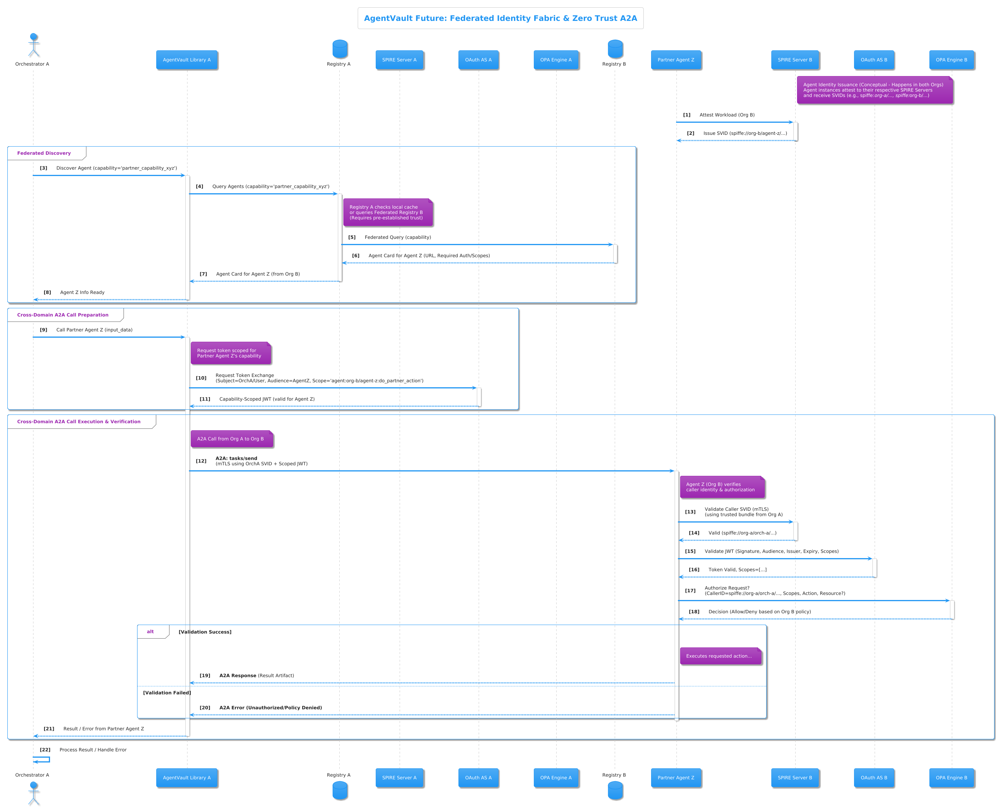

# AgentVault Project Roadmap

This document outlines the planned development phases and features for the AgentVault ecosystem. Our goal is to create a secure, interoperable, and easy-to-use platform for AI agent communication based on open standards like A2A and MCP concepts.

*Disclaimer: This roadmap represents our current plans and priorities. It is subject to change based on development progress, community feedback, and the evolution of underlying standards.*

## Current Status (May 2025 - v1.0.0 Production Release)

**AgentVault v1.0.0 is LIVE and production-ready!** 🎉

This release establishes a stable, secure, and feature-complete foundation for building and managing interoperable AI agent systems based on A2A and MCP principles.

**Key achievements included in v1.0.0:**

*   **Core Components (Stable v1.0.0):**
    *   **`agentvault` Library:** Mature client implementation (A2A JSON-RPC/SSE, Auth Schemes incl. OAuth2, KeyManager w/ Keyring, MCP embedding, Models).
    *   **`agentvault_registry` API & UI:** Fully functional API (Card CRUD, Discovery Filters, Validation) and Web UI (Public Discovery, Developer Portal) with robust developer authentication (Email/Password, JWT, Recovery Keys, Programmatic API Keys), Agent Builder, and PostgreSQL/Alembic backend.
    *   **`agentvault_cli`:** Feature-complete CLI (`config`, `discover`, `run`) supporting KeyManager, SSE streaming, and artifact handling.
    *   **`agentvault_server_sdk`:** Stable SDK (`BaseA2AAgent`, FastAPI integration, `@a2a_method`, `InMemoryTaskStore` w/ notifications), including the `agentvault-sdk package` tool for Dockerization.
    *   **`agentvault_testing_utils`:** Comprehensive shared utilities for robust testing.
*   **Validated POC Pipelines:** Successfully implemented and validated diverse end-to-end examples showcasing core capabilities:
    *   ✅ **MCP Tool Access:** Secure, proxied filesystem & code execution.
    *   ✅ **E-commerce Personalization:** Multi-agent data aggregation for recommendations.
    *   ✅ **Secure ETL Workflows:** Database-driven artifact passing.
    *   ✅ **Multi-Agent Research:** Complex 7-agent orchestration (LangGraph).
    *   ✅ **Dynamics 365 Enrichment & Actions:** Enterprise data wrapping & action triggering.
    *   ✅ **Support Ticket Triage:** Routing & enrichment patterns.
    *   *(POC code and updated documentation released on GitHub)*
*   **Documentation:** Overhauled documentation site providing core concepts, architecture, security details, comprehensive guides for each component, and initial POC overviews.
*   **CI/CD & Security:** Established workflows for dependency security scanning (`pip-audit`) and documentation deployment.

## Immediate Next Steps (Post v1.0.0)

With the v1.0.0 foundation now stable, the immediate focus shifts towards adoption, community engagement, and incremental improvements:

1.  **Community Building & Support:**
    *   Actively engage with early adopters and users on GitHub (Issues, Discussions).
    *   Improve contribution guidelines and onboarding processes.
    *   Respond promptly to feedback and bug reports.
2.  **Documentation Enhancement:**
    *   Create **detailed guides** for each of the released POC pipelines, explaining setup, execution, and the specific AgentVault features demonstrated.
    *   Add more advanced usage examples and tutorials based on user feedback.
    *   Refine API reference documentation.
3.  **Usability & DX Polish:**
    *   Address any minor usability issues or friction points identified in the core components based on initial v1.0.0 feedback.
    *   Potentially enhance the Agent Builder with more options or templates.
    *   Improve error messages and logging for better debugging.
4.  **Maintenance & Bug Fixes:**
    *   Prioritize addressing any bugs or stability issues reported against the v1.0.0 release.
    *   Regularly update dependencies and address security audit findings.
5.  **Begin Phase 3 Exploration:**
    *   Start initial design and feasibility studies for key Phase 3 features (e.g., Federated Registry concepts, SPIFFE/SPIRE integration research for Agent Identity Fabric).

## Future Considerations (Phase 3 & Beyond)

**Objective:** Expand AgentVault into a comprehensive, enterprise-ready platform for secure, scalable, and truly intelligent multi-agent collaboration across diverse environments.

**Concept Diagram:**

*(Diagram illustrating the interplay between federated registries and a zero-trust identity fabric based on SPIFFE/SPIRE, OAuth2, and OPA for secure cross-domain agent communication.)*

**Key Areas:**

1.  **Federated Registry & Discovery:**
    *   Design and implement protocols for secure, policy-based discovery between independent AgentVault Registry instances (private enterprise, partner, public).
    *   Develop mechanisms for establishing and managing trust relationships between registries.
    *   Enhance Agent Cards to support federation metadata and cross-domain policies.
2.  **AgentVault Identity Fabric (Zero Trust IAM for Agents):**
    *   **Goal:** Implement a robust, fine-grained Identity and Access Management system specifically for agents, complementing existing user IAM (like Entra ID).
    *   **Agent Identity (SPIFFE/SPIRE):** Integrate SPIFFE/SPIRE for issuing verifiable, short-lived cryptographic identities (SVIDs) to agent workloads, enabling strong mTLS authentication for A2A.
    *   **Capability-Based Authorization (OAuth2 Scopes/Token Exchange):** Define granular permission scopes based on agent capabilities (from Agent Cards). Implement OAuth 2.0 Token Exchange flows to issue delegated, capability-scoped tokens for agent interactions, enforcing the Principle of Least Privilege.
    *   **Policy Engine Integration (OPA):** Integrate Open Policy Agent (OPA) for decoupled, dynamic authorization decisions based on agent identity, user context, requested capabilities, and custom enterprise policies (Rego).
    *   **Secure Context Propagation:** Define standardized methods for securely passing necessary user and call-chain context between agents.
    *   **Synergy:** This Identity Fabric provides the necessary security primitives for secure and scalable Federated Registry interactions.
3.  **Enhanced A2A/MCP Capabilities:**
    *   **Multimodality (WebRTC):** Integrate `aiortc` or similar libraries for optional real-time audio/video streaming capabilities within the A2A framework.
    *   **Deeper MCP Integration:** Fully align with finalized Model Context Protocol specifications, providing robust SDK helpers for standardized tool use and context passing.
4.  **Advanced Security & Trust:**
    *   **TEE Attestation Verification:** Implement client-side cryptographic verification of Trusted Execution Environment attestations declared in Agent Cards.
    *   **Key Rotation & Management:** Enhanced features for managing registry API keys and potentially agent-level credentials.
    *   **Formal Security Audits:** Engage third-party experts for comprehensive security reviews of the core framework and protocols.
5.  **Ecosystem & Usability:**
    *   **Persistent Task Stores:** Provide robust, production-ready `BaseTaskStore` implementations (e.g., Redis, SQL database).
    *   **UI Enhancements:** Improve Agent Builder capabilities, add registry analytics/monitoring dashboards.
    *   **Other Language SDKs/Libraries:** Explore SDKs for other popular languages like Node.js, Go, etc., based on community demand.
    *   **Community Features:** Implement features like agent reviews/ratings within the registry.

## Contributing

We welcome community contributions! Please see our [CONTRIBUTING.md](CONTRIBUTING.md) for guidelines.