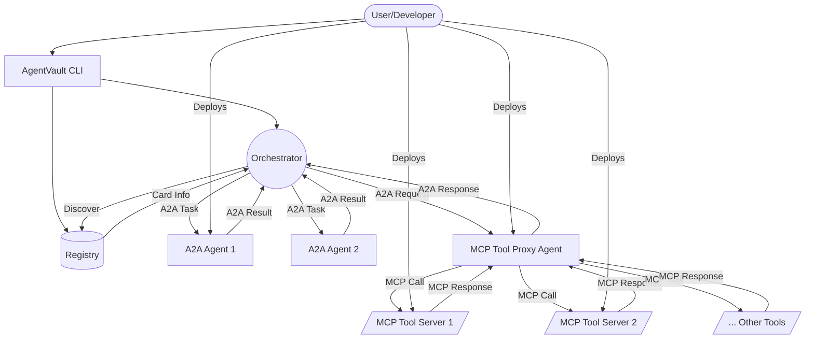

# AgentVault Architecture

This document provides a high-level overview of the AgentVault architecture, illustrating the relationships between key components and communication protocols.

## Core Components & Interactions

The AgentVault ecosystem revolves around several key entities:

1.  **Agents (A2A Compliant):** Independent services exposing capabilities via the **Agent-to-Agent (A2A) Protocol**. They are described by **Agent Cards**. Examples include specialized agents for research, data processing, or interacting with specific APIs.
2.  **MCP Tool Servers:** Services exposing specific, often low-level capabilities (like filesystem access, code execution, database queries, API interactions) via the **Model Context Protocol (MCP)**, which uses JSON-RPC 2.0 over HTTP. These are *not* necessarily full A2A agents.
3.  **AgentVault Registry:** A central discovery service where agents publish their **Agent Cards**. Clients and other agents query the registry to find agents based on their capabilities or unique IDs (HRIs).
4.  **Orchestrator:** A component (e.g., a LangGraph workflow, a Python script, another agent) that coordinates tasks across multiple A2A agents and potentially MCP tools to achieve a complex goal.
5.  **MCP Tool Proxy Agent:** A specialized A2A-compliant agent designed to bridge the A2A and MCP domains. Orchestrators send A2A requests to the proxy, specifying a target MCP tool and its arguments. The proxy translates this into an MCP (JSON-RPC) call to the appropriate **MCP Tool Server**, receives the result, and translates it back into an A2A response for the orchestrator. **This is the current recommended pattern for integrating MCP tools into A2A workflows.**
6.  **Clients / User Interfaces:** Tools like the **AgentVault CLI** or custom applications that allow users to interact with the system, initiate tasks, query the registry, or manage agents.

## Communication Protocols

*   **A2A Protocol:** Used for primary communication between clients, orchestrators, and A2A-compliant agents (including the MCP Tool Proxy Agent). Uses JSON-RPC 2.0 over HTTP(S) with SSE support for streaming.
*   **MCP (Model Context Protocol):** Used for communication between the MCP Tool Proxy Agent and specific MCP Tool Servers. Uses JSON-RPC 2.0 over HTTP(S).

## High-Level Diagram

## Explanation

1.  **User Interaction:** Users typically interact via the CLI or custom applications, which communicate with the Orchestrator or Registry using the A2A protocol.
2.  **Orchestration:** The Orchestrator uses the Registry to discover agents based on their capabilities (defined in their Agent Cards). It then initiates tasks and receives results/events from these agents using the A2A protocol.
3.  **MCP Tool Usage:** When the Orchestrator needs to execute an external tool (like reading a file, running code, querying a specific API):
    *   It sends an A2A request to the **MCP Tool Proxy Agent**. This request includes the logical ID of the target MCP server (e.g., "filesystem", "code-runner", "database-tool"), the specific tool name (e.g., "filesystem.readFile"), and the necessary arguments.
    *   The **MCP Tool Proxy Agent** looks up the actual URL of the target MCP server (e.g., `http://custom-filesystem-mcp:8001/rpc`) and sends a standard JSON-RPC 2.0 request over HTTP to it.
    *   The **MCP Tool Server** executes the requested method and returns a JSON-RPC 2.0 response.
    *   The Proxy Agent relays the result (or error) back to the Orchestrator within the A2A task's response.
4.  **Agent Specialization:** Each component focuses on its core competency. A2A Agents handle complex logic and state, while MCP Tool Servers provide specific, reusable functions via a simple RPC interface. The Proxy pattern decouples the A2A and MCP domains.

This architecture allows for flexible and scalable multi-agent systems where different components communicate using appropriate protocols, facilitated by the AgentVault framework and demonstrated effectively in the **[MCP Test Pipeline Example](./examples/poc_mcp_pipeline.md)**.
