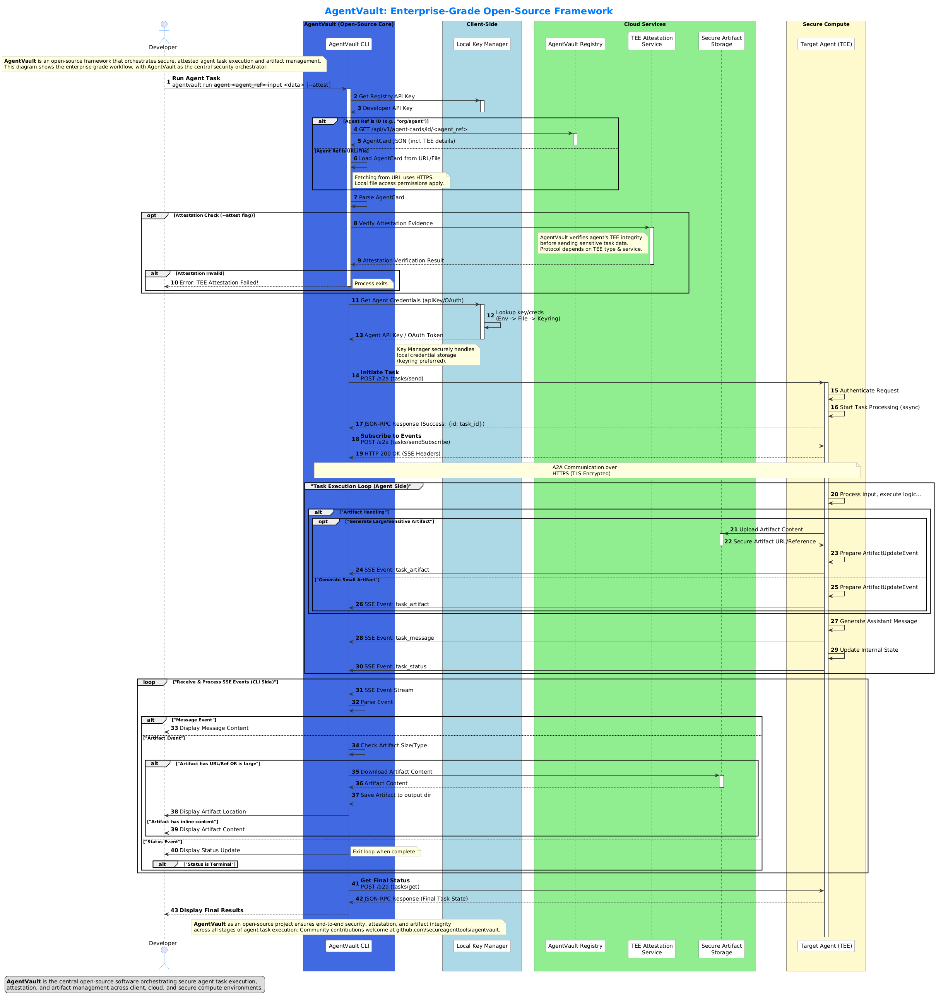

# AgentVault Architecture

This document provides a high-level overview of the AgentVault architecture, illustrating the relationships between key components and communication protocols, emphasizing the secure, enterprise-grade workflow.

## Core Components & Interactions

The AgentVault ecosystem enables secure and orchestrated interactions between various components:

1.  **Developer/User:** The human initiating tasks and managing the system, typically via the CLI.
2.  **AgentVault CLI:** The command-line interface for interacting with AgentVault, including running tasks, managing configurations, and discovering agents.
3.  **Local Key Manager:** A client-side component (using OS keyring, environment variables, or files) responsible for securely storing and retrieving credentials (like Registry API keys or Agent-specific keys/OAuth tokens) needed for authentication.
4.  **AgentVault Registry:** A central discovery service where agents publish their **Agent Cards**. It allows clients to find agents based on their capabilities or unique IDs (HRIs). Developer authentication is required to manage cards.
5.  **Agent (A2A Compliant):** The service performing the core task. In enterprise scenarios, this agent might run within a **Trusted Execution Environment (TEE)** for enhanced security and integrity. It communicates via the A2A protocol.
6.  **TEE Attestation Service (Optional):** An external or integrated service responsible for verifying the integrity and identity of an agent running within a TEE before sensitive operations are performed.
7.  **Secure Artifact Storage (Optional):** A dedicated storage solution (like cloud storage or a secure local store) used for handling large or sensitive data artifacts generated or consumed by agents, referenced via URLs or secure handles rather than being embedded directly in A2A messages.
8.  **AgentVault Library:** Used internally by the CLI (and potentially orchestrators or custom clients) to handle A2A communication, interact with the Key Manager, parse Agent Cards, and manage task lifecycles.
9.  **(Implied) OAuth Authorization Server:** Involved when agents use OAuth2 authentication schemes for secure, delegated access.
10. **(Implied) Policy Engine (e.g., OPA):** Can be integrated by agents or infrastructure for fine-grained authorization decisions (as depicted in the Federated Identity concept).

## Communication Protocols

*   **A2A Protocol:** The primary protocol for task management and communication between the CLI/Orchestrator and A2A-compliant Agents. Uses JSON-RPC 2.0 over HTTPS, with SSE for event streaming.
*   **Registry API:** A RESTful API (HTTPS) used by the CLI and developers to manage and discover Agent Cards.
*   **Attestation Protocol:** Specific protocol dependent on the TEE technology used (e.g., SGX Remote Attestation, AWS Nitro Attestation) used between the Agent (in TEE), the Attestation Service, and potentially the Client/CLI.
*   **Storage Protocol:** Standard protocols like HTTPS (S3 API, etc.) used for interacting with Secure Artifact Storage.
*   **MCP (Model Context Protocol):** Used for agent-to-tool communication, typically via a proxy agent. (See [MCP Profile](./mcp.md) and [MCP Example](./examples/poc_mcp_pipeline.md)).
*   **LLM Integration:** Direct integration with large language models (LLMs) like Qwen3-8B to enhance agent capabilities with sophisticated reasoning and decision-making. (See [SecOps Pipeline Example](./examples/poc_secops.md)).

## High-Level Architecture Diagram

The following diagram visualizes the key components and a typical secure workflow, including optional TEE attestation:

*(Diagram showing the Developer interacting via CLI, which uses the KeyManager and Registry. The CLI optionally checks attestation with an Attestation Service before initiating a task with a Target Agent (potentially in a TEE). The Agent may interact with Secure Artifact Storage and streams results back to the CLI via A2A/SSE.)*

## Explanation of Secure Workflow

1.  **Task Initiation:** The Developer uses the **AgentVault CLI** to run a task on a target agent, specifying the agent reference (HRI or URL) and input data. The `--attest` flag can be used to request TEE attestation verification.
2.  **Agent Discovery (if HRI used):** The CLI contacts the **AgentVault Registry** (authenticating using a Developer API Key fetched from the **Local Key Manager**) to retrieve the **Agent Card** for the target agent.
3.  **Agent Card Parsing:** The CLI parses the Agent Card to get the agent's A2A endpoint URL, required authentication schemes, and TEE details (if present).
4.  **TEE Attestation (Optional):** If the `--attest` flag was used and the Agent Card indicates TEE support, the CLI interacts with the appropriate **TEE Attestation Service** to verify the integrity and identity of the target agent instance *before* sending the task. If verification fails, the process stops.
5.  **Credential Retrieval:** The CLI requests the necessary credentials (API Key, OAuth details) for the target agent from the **Local Key Manager**. The Key Manager securely retrieves these based on the agent's requirements specified in the card.
6.  **A2A Task Initiation:** The CLI (using the underlying AgentVault Library) establishes a secure HTTPS connection to the **Target Agent's** A2A endpoint. It sends the `tasks/send` request (JSON-RPC), including the task input and necessary authentication headers (API Key or Bearer Token obtained via Key Manager/OAuth flow).
7.  **Agent Processing & SSE Streaming:**
    *   The Target Agent authenticates the request.
    *   It begins processing the task asynchronously.
    *   The CLI establishes an SSE connection (`tasks/sendSubscribe`) to receive real-time updates.
    *   The Agent streams `task_status`, `task_message`, and `task_artifact` events back to the CLI via SSE over HTTPS.
    *   **Artifact Handling:** If the agent generates large or sensitive artifacts, it may upload them to **Secure Artifact Storage** and send back only a URL or reference in the `task_artifact` event. Small artifacts might be included directly in the event.
8.  **Event Processing (CLI):**
    *   The CLI receives and parses SSE events.
    *   It displays status updates and messages to the Developer.
    *   For artifact events, if a URL/reference is present (or the artifact is deemed large), the CLI may download the content from **Secure Artifact Storage**. Otherwise, it displays/saves inline content.
    *   The SSE loop continues until a terminal task status (COMPLETED, FAILED, CANCELED) is received.
9.  **Final Status:** The CLI may optionally make a final `tasks/get` call to retrieve the complete final task state.
10. **Results:** The CLI displays the final results, status, and any relevant artifact locations or content to the Developer.

This workflow, leveraging components like the Key Manager, Registry, optional TEE Attestation, and distinct communication protocols (A2A, MCP via proxy), provides a secure and robust framework for orchestrating complex agent tasks.