# AgentVault MCP Support (Proxy Pattern - v1.0.0)

**Status:** Defined & Implemented via Proxy Pattern

## 1. Introduction

The AgentVault Agent-to-Agent (A2A) protocol defines the core mechanisms for secure communication, task management, and event streaming between agents. However, many complex agent interactions require agents to execute external **Tools** (e.g., filesystem access, code execution, database queries, specialized APIs).

The **Model Context Protocol (MCP)** is a conceptual protocol designed for agent-tool interaction, typically using JSON-RPC 2.0 over HTTP(S). While direct client-library support for invoking MCP tools may evolve, **AgentVault v1.0.0 provides a robust and validated solution for integrating MCP tools via the A2A Proxy Pattern.**

**Goal:** To enable standardized, reusable, secure, and controlled access to external capabilities within AgentVault workflows without requiring the orchestrator or core agents to directly implement the MCP protocol.

## 2. The A2A Proxy Pattern

The recommended and validated pattern in AgentVault v1.0.0 for integrating MCP tools involves a dedicated **MCP Tool Proxy Agent**:

*   **MCP Tool Proxy Agent:** An A2A-compliant agent (built using the `agentvault-server-sdk`) acts as a secure bridge between the A2A domain and the MCP domain.
*   **MCP Tool Server:** A separate service (potentially non-A2A compliant itself) that exposes specific tools (e.g., `filesystem.readFile`, `code.runPython`) via an MCP-compatible JSON-RPC 2.0 HTTP endpoint (typically `/rpc`).
*   **Orchestrator/Client:** An A2A client (like the `agentvault-cli`, a LangGraph orchestrator, or a custom application using the `agentvault` library) that needs to invoke an MCP tool.

**Workflow:**

1.  **A2A Request to Proxy:** The Orchestrator sends a standard A2A `tasks/send` request to the Proxy Agent's `/a2a` endpoint. The crucial information about the desired MCP call is embedded within a `DataPart` of the A2A `Message`.
2.  **Proxy Authentication & Routing:** The Proxy Agent authenticates the Orchestrator using standard A2A mechanisms (API Key, OAuth2 via `KeyManager`). It then parses the `DataPart` to identify the target MCP server and tool.
3.  **MCP Request from Proxy:** The Proxy Agent looks up the target MCP Tool Server's URL (e.g., from its configuration) and sends a standard MCP JSON-RPC 2.0 request (e.g., `{"method": "filesystem.readFile", "params": {...}}`) via HTTP POST to the Tool Server's `/rpc` endpoint.
4.  **MCP Tool Execution:** The MCP Tool Server executes the requested tool.
5.  **MCP Response to Proxy:** The Tool Server sends a JSON-RPC 2.0 response back to the Proxy Agent (containing either a `result` or an `error`, potentially using the `isError: true` convention within the `result` for tool-level errors).
6.  **A2A Response from Proxy:** The Proxy Agent translates the MCP response into a standard A2A format (e.g., placing the MCP `result` or error details within a `DataPart` of an assistant `Message` or `Artifact`) and sends it back to the Orchestrator via the A2A task's SSE stream or final result.

**Diagram:**

```mermaid
graph LR
    subgraph ClientSide [Orchestrator / Client]
        Orchestrator("🤖 Orchestrator")
    end

    subgraph AgentVaultInfra [AgentVault Infrastructure]
        ProxyAgent["🛡️ MCP Tool Proxy Agent<br>(A2A Compliant)<br><i>Authenticates Client</i>"]
    end

    subgraph ToolServerSide [External Tool Server]
        ToolServer("🛠️ MCP Tool Server<br>(JSON-RPC @ /rpc)")
    end

    Orchestrator -- "1. A2A Request<br>(via HTTPS + Auth Header)<br>Payload includes DataPart:<br>{target_id, tool_name, args}" --> ProxyAgent

    ProxyAgent -- "2. MCP Request<br>(via HTTPS)<br>{method: tool_name, params: args}" --> ToolServer

    ToolServer -- "3. MCP Response<br>(via HTTPS)<br>{result: ...} or {error: ...}" --> ProxyAgent

    ProxyAgent -- "4. A2A Response / Event<br>(via HTTPS / SSE)<br>Contains translated MCP result/error" --> Orchestrator

    style ClientSide fill:#e3f2fd,stroke:#90caf9
    style AgentVaultInfra fill:#e8f5e9,stroke:#a5d6a7
    style ToolServerSide fill:#fce4ec,stroke:#f8bbd0
```



## 3. A2A Message Structure (Client -> Proxy)

Instead of using `message.metadata["mcp_context"]`, the client sends instructions to the proxy embedded within a `DataPart` inside the standard A2A `Message.parts` list.

**Required `DataPart.content` structure:**

```json
{
  "target_mcp_server_id": "filesystem", // Logical ID mapped to URL in Proxy config
  "tool_name": "filesystem.readFile",   // The MCP method to call
  "arguments": {                        // Parameters for the MCP method
    "path": "/data/input.txt"
  }
}
```

**Example A2A Message sent by Orchestrator to Proxy Agent:**

```json
// This is the JSON-RPC 'params.message' field in the tasks/send request
{
  "role": "user", // Or 'system' / 'assistant' depending on orchestrator
  "parts": [
    {
      "type": "data",
      "mediaType": "application/json", // Recommended
      "content": {
        "target_mcp_server_id": "code",
        "tool_name": "code.runPython",
        "arguments": {
          "code": "print('Hello from proxied MCP call!')"
        }
      }
    }
    // Optionally include a TextPart for human context if needed
    // { "type": "text", "content": "Execute the code specified in the data part."}
  ],
  "metadata": null // metadata["mcp_context"] is NOT used for this pattern
}
```

## 4. Client-Side Usage (`agentvault` Library)

To invoke an MCP tool via the proxy pattern using the client library:

1.  Load the **Proxy Agent's** `AgentCard`.
2.  Instantiate `KeyManager` for the Proxy Agent's authentication.
3.  Construct the A2A `Message` with the correct `DataPart` payload (as shown above).
4.  Use `AgentVaultClient.initiate_task` (or `send_message`) targeting the **Proxy Agent**.
5.  Process the A2A events/response received *from the Proxy Agent*, which will contain the translated result or error from the underlying MCP call.

```python
import asyncio
from agentvault import (
    AgentVaultClient, KeyManager, Message, DataPart,
    agent_card_utils, models as av_models, exceptions as av_exceptions
)

async def call_mcp_via_proxy(
    proxy_agent_ref: str, # ID, URL, or file path for the *Proxy* Agent
    target_mcp_server_id: str,
    tool_name: str,
    arguments: dict
):
    key_manager = KeyManager(use_keyring=True) # Assuming proxy might need auth
    proxy_card = None
    task_id = None

    try:
        # Load the PROXY agent's card
        proxy_card = await agent_card_utils.fetch_agent_card_from_url(proxy_agent_ref) # Example load
        if not proxy_card: raise ValueError("Proxy agent card not found")

        # Prepare the DataPart payload for the proxy
        proxy_instruction_payload = {
            "target_mcp_server_id": target_mcp_server_id,
            "tool_name": tool_name,
            "arguments": arguments
        }
        initial_message = Message(
            role="user", # Or appropriate role
            parts=[DataPart(content=proxy_instruction_payload)]
        )

        async with AgentVaultClient() as client:
            print(f"Sending tool request to Proxy Agent: {proxy_card.human_readable_id}")
            task_id = await client.initiate_task(
                agent_card=proxy_card,
                initial_message=initial_message,
                key_manager=key_manager
            )
            print(f"Proxy Task initiated: {task_id}")

            # Stream events FROM THE PROXY
            async for event in client.receive_messages(proxy_card, task_id, key_manager):
                 if isinstance(event, av_models.TaskStatusUpdateEvent):
                     print(f"  Proxy Task Status: {event.state}")
                     if event.state.is_terminal(): break # Proxy task finished
                 elif isinstance(event, av_models.TaskMessageEvent):
                     # The proxy wraps the MCP result/error in a message part
                     print(f"  Proxy Response Message:")
                     for part in event.message.parts:
                         if isinstance(part, DataPart):
                             print(f"    Data Result/Error from MCP: {part.content}")
                             # TODO: Parse part.content (which should match McpToolExecOutput)
                             # to check success/error and extract MCP result
                         else:
                             print(f"    Other Part: {part}")
                 # Handle other events...

    except av_exceptions.AgentVaultError as e:
        print(f"AgentVault Error: {e}")
    except Exception as e:
        print(f"Unexpected Error: {e}")

# Example Call
# asyncio.run(call_mcp_via_proxy(
#     proxy_agent_ref="http://localhost:8059/agent-card.json",
#     target_mcp_server_id="filesystem",
#     tool_name="filesystem.readFile",
#     arguments={"path": "/data/test_script.py"}
# ))
```

## 5. Server-Side Usage (Implementing the Proxy Agent)

The MCP Tool Proxy Agent itself (built with `agentvault-server-sdk`):

1.  Receives the A2A `Message` in its `handle_task_send` method.
2.  Extracts the `target_mcp_server_id`, `tool_name`, and `arguments` from the incoming `Message.parts` (specifically looking for the `DataPart`).
3.  Looks up the target MCP server's base URL using the `target_mcp_server_id` (e.g., from an environment variable map `MCP_SERVER_MAP`).
4.  Uses an HTTP client (like `httpx`) to make the JSON-RPC 2.0 POST request to the target MCP server's `/rpc` endpoint.
5.  Parses the JSON-RPC response from the MCP server.
6.  Uses its `TaskStore` (`notify_message_event` or `notify_artifact_event`) to send the outcome back to the original A2A caller, wrapping the MCP result/error within a `DataPart`.

*(See the `mcp-tool-proxy-agent/src/mcp_tool_proxy_agent/agent.py` file in the POC for a concrete implementation.)*

## 6. Underlying MCP Protocol Details (Proxy <-> Tool Server)

The communication *between the Proxy Agent and the MCP Tool Server* uses JSON-RPC 2.0 over HTTPS POST, typically to an `/rpc` endpoint on the tool server.

*   **Request:** Standard JSON-RPC request where `method` is the tool name (e.g., `filesystem.readFile`) and `params` contains the arguments object.
*   **Response (Success):** JSON-RPC response where the `result` field contains the tool's output, often structured with a `content` array (e.g., `{"content": [{"type": "text", "text": "file data"}]}`).
*   **Response (Tool Error):** JSON-RPC response where the `result` field contains `{"isError": true, "content": [{"type": "text", "text": "Error message"}]}`.
*   **Response (Protocol Error):** Standard JSON-RPC `error` object (e.g., for method not found, invalid params).

## 7. Future Considerations

While the A2A Proxy Pattern is robust and recommended for v1.0.0, future work could include:

*   Adding direct MCP client support to the `agentvault` library for simpler scenarios where a proxy isn't desired (though this requires careful security consideration).
*   Further standardization of MCP tool schemas and discovery mechanisms.
*   Refining the `mcp_utils` in the core library to align with official MCP specifications as they mature.

