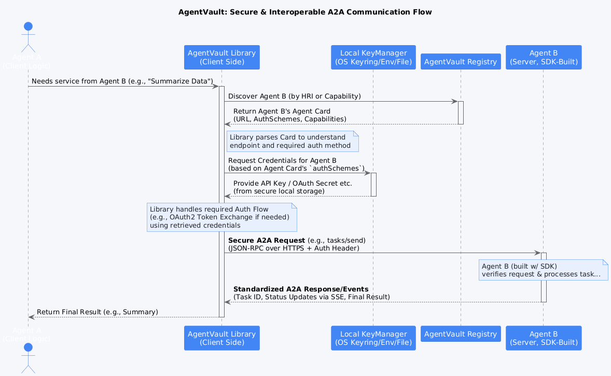

# Agent-to-Agent (A2A) Communication Profile - v0.2 (Draft)

**Status:** Draft / Under Development (Based on POC Implementations)

## 1. Introduction

This document defines the baseline Agent-to-Agent (A2A) communication profile used within the AgentVault framework. It specifies the transport protocol, message format, core methods, and event streaming mechanism necessary for interoperable communication between A2A-compliant agents, clients, and orchestrators.

**Goal:** To establish a reliable, secure, and standardized way for agents to interact, initiate tasks, exchange information, and provide real-time updates.

## 2. Transport and Format

*   **Transport:** HTTP/1.1 or HTTP/2 over TLS (HTTPS) is **REQUIRED** for all communication, except for explicitly local development environments (e.g., `http://localhost:*`, `http://127.0.0.1:*`).
*   **Message Format:** JSON-RPC 2.0 ([Specification](https://www.jsonrpc.org/specification)) is used for all request/response interactions.
    *   `Content-Type` header **MUST** be `application/json`.
    *   All requests **MUST** include `"jsonrpc": "2.0"`.
    *   Requests **SHOULD** include a unique `id` (string or number) for correlation, unless they are Notifications.
    *   Responses **MUST** include the same `id` as the request they are responding to.
    *   Successful responses **MUST** include a `result` field.
    *   Error responses **MUST** include an `error` object with `code` (integer) and `message` (string) fields. An optional `data` field can contain additional error information.

## 3. Authentication

Agent authentication is described within the `authSchemes` section of an agent's [Agent Card](./concepts.md#agent-card). Clients MUST support at least one scheme advertised by the agent. Current supported schemes include:

*   `none`: No authentication required.
*   `apiKey`: Requires an API key, typically sent via the `X-Api-Key` HTTP header.
*   `bearer`: Requires a bearer token (e.g., JWT), sent via the `Authorization: Bearer <token>` HTTP header.
*   `oauth2` (Client Credentials Grant): Requires the client to obtain a Bearer token from a specified `tokenUrl` using its client ID and secret, then use the token as per the `bearer` scheme. The Agent Card MUST provide the `tokenUrl`. `scopes` may optionally be specified.

The `agentvault` client library includes a `KeyManager` to securely store and retrieve credentials based on the `service_identifier` provided in the `AgentAuthentication` scheme object.

## 4. Core A2A Methods (JSON-RPC)

All A2A interactions happen via a single agent endpoint URL specified in the Agent Card (e.g., `https://agent.example.com/a2a/`). The specific action is determined by the JSON-RPC `method` field.

### 4.1. `tasks/send`

*   **Purpose:** Initiates a new task or sends a subsequent message/input to an existing task.
*   **Params (`object`):**
    *   `id` (`string` | `null`): The ID of the task to send the message to. If `null` or omitted, a *new* task is initiated.
    *   `message` ([Message Object](./models/a2a_protocol.md#message)): The message object containing the `role`, `parts`, and optional `metadata`.
    *   *(Optional)* `webhookUrl` (`string`): A URL the client provides where the agent MAY send push notifications (e.g., task completion) if the agent supports it (advertised via `supportsPushNotifications` in Agent Card Capabilities). This is an *alternative* or *complement* to SSE streaming.
*   **Result (`object`):**
    *   `id` (`string`): The ID of the task (either newly created or the one the message was sent to).
    *   *(Optional)* Other initial status information may be included.

### 4.2. `tasks/get`

*   **Purpose:** Retrieves the current status and details of a specific task.
*   **Params (`object`):**
    *   `id` (`string`): The ID of the task to retrieve.
*   **Result ([Task Object](./models/a2a_protocol.md#task)):** The complete `Task` object representing the current state, including messages and artifacts.

### 4.3. `tasks/cancel`

*   **Purpose:** Requests the cancellation of an ongoing task. Note that cancellation may be asynchronous.
*   **Params (`object`):**
    *   `id` (`string`): The ID of the task to cancel.
*   **Result (`object`):**
    *   `success` (`boolean`): Indicates if the agent *accepted* the cancellation request (typically `true`). Does not guarantee immediate termination.
    *   `message` (`string`, optional): An optional message from the agent regarding the cancellation.

### 4.4. `tasks/sendSubscribe`

*   **Purpose:** Initiates a Server-Sent Events (SSE) stream for a specific task. The client sends this request, and the server responds with an `text/event-stream` response that remains open.
*   **Params (`object`):**
    *   `id` (`string`): The ID of the task to subscribe to.
*   **Result:** This method does *not* return a standard JSON-RPC `result`. Instead, the server responds with:
    *   HTTP Status Code `200 OK`.
    *   `Content-Type: text/event-stream`.
    *   `Cache-Control: no-cache`.
    *   `Connection: keep-alive`.
    *   The response body contains the SSE event stream (see Section 5).

## 5. Server-Sent Events (SSE) Streaming

Agents supporting real-time updates use SSE to push events to subscribed clients.

*   **Endpoint:** The same endpoint as JSON-RPC calls (e.g., `/a2a/`), initiated via the `tasks/sendSubscribe` method.
*   **Format:** Standard SSE format ([W3C Specification](https://html.spec.whatwg.org/multipage/server-sent-events.html#server-sent-events)). Each message consists of one or more lines ending in `\n`, with an empty line (`\n\n`) separating messages.
*   **Fields:**
    *   `event`: Specifies the type of event (e.g., `task_status`, `task_message`, `task_artifact`, `error`). If omitted, defaults to `message`.
    *   `data`: Contains the event payload as a **single JSON string**. Multi-line JSON objects MUST be sent as a single `data:` field potentially spanning multiple lines in the raw SSE message, but logically representing one JSON string.
    *   `id`: Optional event ID.
    *   `retry`: Optional reconnection time in milliseconds.

### 5.1. Standard Event Types

*   **`event: task_status`**
    *   **`data`:** JSON object matching the [TaskStatusUpdateEvent](./models/a2a_protocol.md#taskstatusupdateevent) model.
*   **`event: task_message`** (or default `message` event type)
    *   **`data`:** JSON object matching the [TaskMessageEvent](./models/a2a_protocol.md#taskmessageevent) model.
*   **`event: task_artifact`**
    *   **`data`:** JSON object matching the [TaskArtifactUpdateEvent](./models/a2a_protocol.md#taskartifactupdateevent) model.
*   **`event: error`**
    *   **`data`:** A JSON object providing details about an error occurring *during* the SSE stream or asynchronous task processing (distinct from JSON-RPC errors). The structure is flexible but SHOULD include `code` and `message`.
        ```json
        // Example Error Event Data
        {
          "code": "AGENT_PROCESSING_ERROR",
          "message": "Failed to process intermediate step X.",
          "details": { ... }
        }
        ```

*   **Comments:** Lines starting with `:` are comments and should be ignored by clients. They can be used for keep-alives.

## 6. Communication Flow Diagram

The following diagram illustrates a typical A2A communication flow involving discovery, task initiation, and event streaming:


*(Diagram showing Agent A discovering Agent B via Registry, retrieving the Agent Card, potentially getting credentials via KeyManager, initiating a task via A2A Request, and receiving SSE events and the final response.)*

## 7. Versioning

This document describes **Profile v0.2**. Agents SHOULD indicate the A2A protocol version they support in their Agent Card's `capabilities.a2aVersion` field. Clients SHOULD check this version, although strict compatibility enforcement is not currently mandated for v0.2. Future versions of the protocol will introduce more formal version negotiation.

## 8. Error Handling

JSON-RPC standard error codes ([link](https://www.jsonrpc.org/specification#error_object)) should be used for protocol-level errors.

*   `-32700 Parse error`: Invalid JSON received.
*   `-32600 Invalid Request`: JSON is not a valid Request object.
*   `-32601 Method not found`: Method does not exist/is not available.
*   `-32602 Invalid params`: Invalid method parameters.
*   `-32603 Internal error`: Internal JSON-RPC error.
*   `-32000` to `-32099`: Server error. Implementation-defined server errors. Agents SHOULD use codes in this range for application-specific errors (e.g., task processing failed, authentication required but missing).

The `error` object's `data` field can provide additional context specific to the error.
