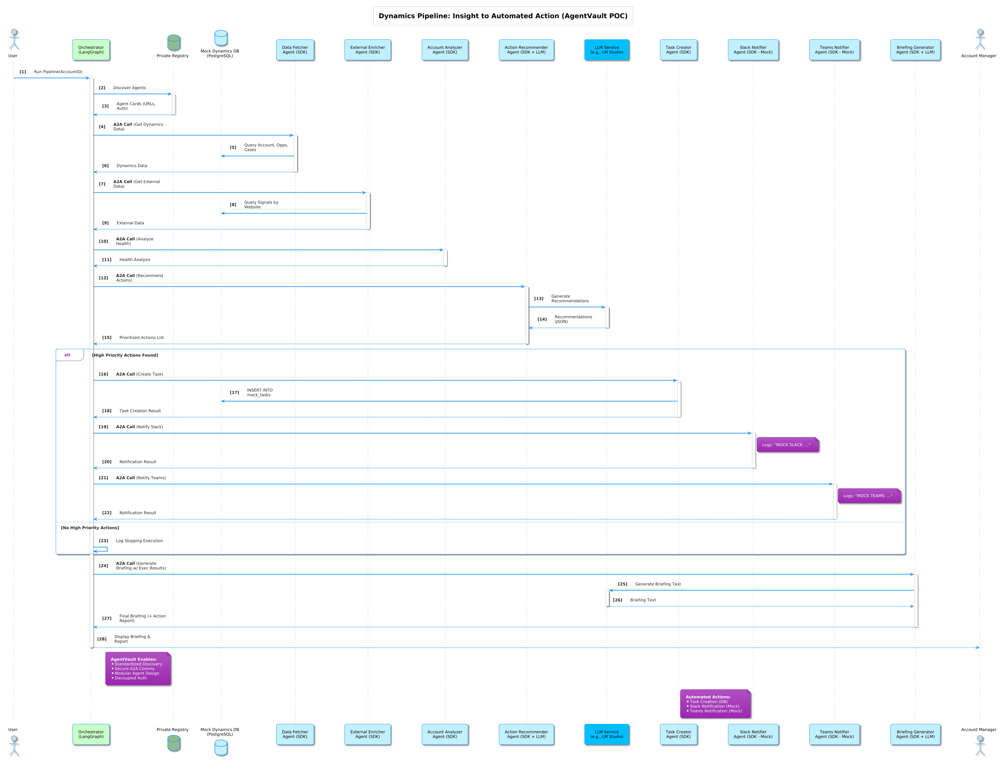

# Dynamics 365 Pipeline Example

This Proof-of-Concept (POC) demonstrates a multi-agent pipeline simulating the analysis of Dynamics 365 CRM data, enriched with external signals, to generate insights and trigger actions for account managers.

## Overview

The pipeline integrates data fetching, external enrichment, rule-based analysis, LLM-driven recommendation and briefing generation, and action execution (task creation, notifications). It showcases how AgentVault can orchestrate complex business workflows involving both internal data and external intelligence.

## Workflow Diagram

This diagram outlines the flow of data and control between the orchestrator and the various agents involved in the Dynamics 365 pipeline.


*(Diagram showing the orchestrator coordinating calls to the Dynamics Fetcher, External Enricher, Analyzer, Recommender, Action Executors (Task Creator, Notifiers), and Briefing Generator.)*

## Workflow Steps

1.  **Orchestrator (`dynamics_orchestrator`) -> Dynamics Data Fetcher Agent (`local-poc/dynamics-data-fetcher`)**
    *   **Input:** `account_id`.
    *   **Action:** Queries a mock PostgreSQL database (simulating Dynamics) for Account, Contact, Opportunity, and Case data related to the `account_id`.
    *   **Output:** `dynamics_data` artifact containing the fetched records.
2.  **Orchestrator -> External Data Enricher Agent (`local-poc/external-data-enricher`)**
    *   **Input:** `website` (extracted from the `dynamics_data` artifact).
    *   **Action:** Queries a mock database for external signals (News, Intent Signals, Technologies) associated with the company website.
    *   **Output:** `external_data` artifact.
3.  **Orchestrator -> Account Health Analyzer Agent (`local-poc/account-health-analyzer`)**
    *   **Input:** `dynamics_data`, `external_data` artifacts.
    *   **Action:** Applies rule-based logic (or optionally an LLM) to assess account health (Risk, Opportunity, Engagement levels) based on the combined data.
    *   **Output:** `account_analysis` artifact.
4.  **Orchestrator -> Action Recommendation Agent (`local-poc/action-recommender`)**
    *   **Input:** `dynamics_data`, `external_data`, `account_analysis` artifacts.
    *   **Action:** Uses an LLM to analyze the context and generate 2-3 prioritized, actionable recommendations (Next Best Actions) for the account manager, including rationale and related record IDs where applicable.
    *   **Output:** `recommended_actions` artifact.
5.  **Orchestrator (Action Execution Node):**
    *   **Input:** `recommended_actions` artifact.
    *   **Action:** Filters for 'High' priority actions. For each:
        *   Calls **Dynamics Task Creator Agent (`local-poc/dynamics-task-creator`)** to create a task in the mock DB.
        *   Calls **Slack Notifier Agent (`local-poc/slack-notifier`)** to log a mock Slack notification.
        *   Calls **Teams Notifier Agent (`local-poc/teams-notifier`)** to log a mock Teams notification.
    *   **Output:** Updates state with `action_execution_results`.
6.  **Orchestrator -> Briefing Generator Agent (`local-poc/account-briefing-generator`)**
    *   **Input:** `dynamics_data`, `external_data`, `account_analysis`, `recommendations`, `execution_results` artifacts/state.
    *   **Action:** Uses an LLM to synthesize all gathered information into a concise briefing for the account manager, including a summary of executed actions.
    *   **Output:** `account_briefing` artifact (text).
7.  **Orchestrator:** Logs the final status, briefing, and execution results.

## Components

*   **`poc_agents/dynamics_pipeline/`**: Root directory for this POC.
    *   **`db/`**: PostgreSQL initialization scripts (`init-d365-data.sql`, `ensure_mock_tasks.sql`).
    *   **`agents/`**: Separate directories for each agent (Fetcher, Enricher, Analyzer, Recommender, Briefer, Task Creator, Slack Notifier, Teams Notifier), each containing source code, `agent-card.json`, Dockerfile, `.env`, etc.
    *   **`dynamics_pipeline_orchestrator/`**: LangGraph-based orchestrator managing the workflow.
    *   **`docker-compose.yml`**: Runs the PostgreSQL database, all agents, and the orchestrator.

## Setup

1.  **Prerequisites:** Docker, Docker Compose, Python 3.10+, Poetry. Ensure the `agentvault_network` Docker network exists (`docker network create agentvault_network`). The AgentVault Registry should also be running. An OpenAI-compatible LLM Server (like LM Studio) is required for the Recommender and Briefer agents.
2.  **Database:** The `docker-compose.yml` defines a PostgreSQL service (`d365-db`) initialized with mock CRM data.
3.  **LLM Server:** Ensure your LLM server is running and accessible (e.g., `http://host.docker.internal:1234/v1`). Load a suitable model (e.g., Llama 3 Instruct 8B).
4.  **Environment Variables:**
    *   Each agent directory has an `.env` file. Key variables:
        *   Fetcher, Enricher, Task Creator: `DATABASE_*` variables to connect to `d365-db`.
        *   Analyzer, Briefer, Recommender: `LLM_API_URL`, `LLM_MODEL_NAME`.
    *   The orchestrator's `.env` needs `AGENTVAULT_REGISTRY_URL`.
5.  **Build & Run Docker Compose:**
    *   Navigate to the `poc_agents/dynamics_pipeline/` directory.
    *   Run: `docker-compose build`
    *   Run: `docker-compose up -d`

## Running the POC

The orchestrator runs automatically on startup, triggered by the Dockerfile's `CMD`. It processes a default Account ID (`ACC-GUID-SVA` - Quantum Dynamics) specified in the `docker-compose.yml`. You can change this default or trigger runs for other accounts via `docker exec`.

1.  **Monitor Logs:** Observe the orchestrator's logs:
    ```bash
    docker logs -f dynamics-pipeline-orchestrator
    ```
2.  **Run for a Different Account:**
    ```bash
    # Example: Run for Acme Corp
    docker exec -it dynamics-pipeline-orchestrator python -m dynamics_orchestrator.run ACC-GUID-001

    # Example: Run for Beta Solutions
    docker exec -it dynamics-pipeline-orchestrator python -m dynamics_orchestrator.run ACC-GUID-002
    ```
3.  **Check Database:** Connect to the `d365-db` container or use a DB client (connecting to `localhost:5435`) to inspect the `mock_tasks` table for created tasks.

## Example Run (GIF)

This animation shows the log output when the Dynamics 365 pipeline is run for the default "Quantum Dynamics" account, highlighting the various agent calls and the final generated briefing.


*(Animation showing logs from the orchestrator calling the fetcher, enricher, analyzer, recommender, task creator, notifiers, and briefer agents)*

## Expected Output

*   **Orchestrator Logs:** Show the pipeline steps, agent calls, analysis results, recommendations, action execution attempts (task creation, notifications), and the final briefing.
*   **`mock_tasks` Table:** Contains new task records if high-priority actions were recommended and the Task Creator agent succeeded.
*   **Agent Logs:** Individual agent logs show mock database queries, LLM calls (for recommender/briefer), and mock notification attempts.

## Key Features Demonstrated

*   **Business Workflow Automation:** Orchestrating a CRM-centric analysis and action pipeline.
*   **Data Integration:** Combining mock internal CRM data with mock external signals.
*   **Hybrid Analysis:** Using both rule-based logic (Analyzer) and LLM generation (Recommender, Briefer).
*   **Action Execution:** Triggering downstream actions (mock task creation, notifications) based on pipeline insights.
*   **Database Interaction:** Agents interacting with a PostgreSQL database simulating a CRM backend.
*   **LangGraph Orchestration:** Defining the complex workflow with conditional logic.
*   **AgentVault Client/SDK:** Enabling communication and task management.
*   **Docker Compose:** Managing a multi-container application with a database.
