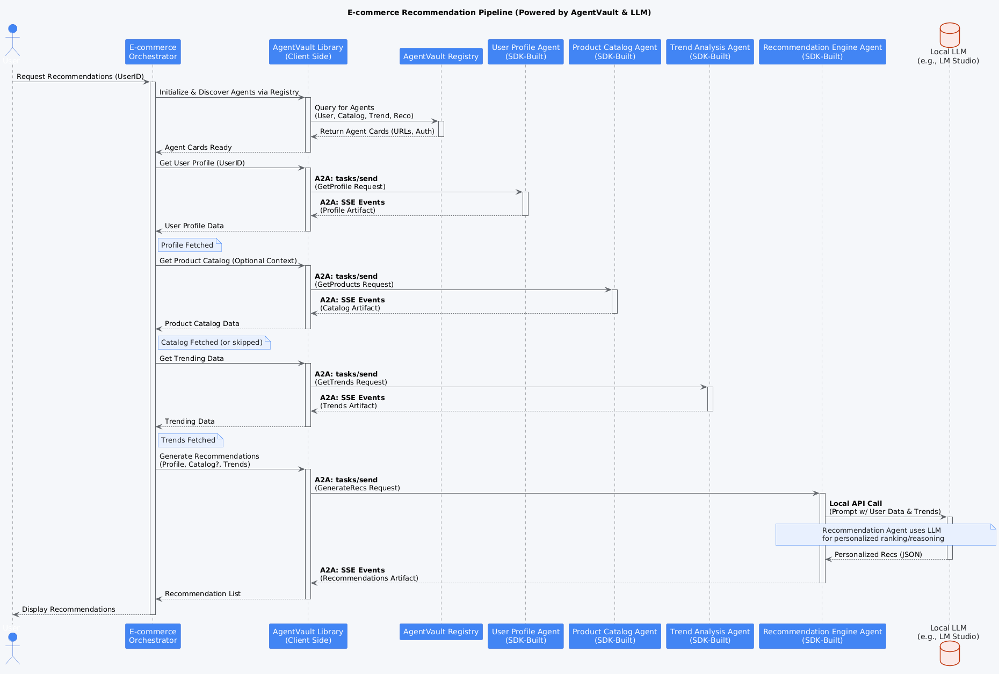

# E-commerce Recommendation Pipeline Example

This Proof-of-Concept (POC) demonstrates a multi-agent pipeline for generating personalized e-commerce product recommendations.

## Overview

The pipeline simulates a common e-commerce scenario where user behavior, product information, and current trends are combined to suggest relevant products. It showcases how specialized agents can collaborate within the AgentVault framework.

## Workflow Diagram

This diagram shows the flow where the orchestrator gathers context from profile, catalog, and trend agents before calling the recommendation engine.


*(Diagram illustrating the flow: Orchestrator calls User Profile, Product Catalog, and Trend Analysis agents, aggregates the context, and then calls the Recommendation Engine.)*

## Workflow Steps

1.  **Orchestrator (`ecommerce_orchestrator`)** -> **User Profile Agent** (`local-poc/ecommerce-user-profile`)
    *   **Input:** `user_id`.
    *   **Output:** User profile data (purchase history, browsing history, preferences).
2.  **Orchestrator** -> **Product Catalog Agent** (`local-poc/ecommerce-product-catalog`)
    *   **Input:** Product IDs (e.g., from user history or context) or search term.
    *   **Output:** Detailed product information.
3.  **Orchestrator** -> **Trend Analysis Agent** (`local-poc/ecommerce-trend-analysis`)
    *   **Input:** Timeframe (e.g., "7d").
    *   **Output:** List of trending product IDs and categories.
4.  **Orchestrator (Aggregate Node):** Combines results from the previous steps.
5.  **Orchestrator** -> **Recommendation Engine Agent** (`local-poc/ecommerce-recommendation-engine`)
    *   **Input:** Aggregated context (user profile, relevant product details, trending data).
    *   **Output:** List of personalized product recommendations with scores and reasoning.
6.  **Orchestrator:** Saves final recommendations and intermediate artifacts locally.

## Components

*   **`poc_agents/ecommerce_pipeline/`**: Root directory for this POC.
    *   **`ecommerce_user_profile_agent/`**: Mock agent providing user data.
    *   **`ecommerce_product_catalog_agent/`**: Mock agent providing product details.
    *   **`ecommerce_trend_analysis_agent/`**: Mock agent providing trending data.
    *   **`ecommerce_recommendation_engine_agent/`**: Mock agent generating recommendations based on input.
    *   **`ecommerce_pipeline_orchestrator/`**: LangGraph-based orchestrator managing the workflow.
    *   **`docker-compose.yml`**: Runs all agents and the orchestrator.
    *   **`documentation/`**: Contains explanatory documents (`agent_implementations.md`, `fixes.md`).

## Setup

1.  **Prerequisites:** Docker, Docker Compose, Python 3.10+, Poetry. Ensure the `agentvault_network` Docker network exists (`docker network create agentvault_network`). The AgentVault Registry should also be running (typically via its own `docker-compose.yml` in the main `agentvault_registry` directory).
2.  **Environment Variables:** Review/create `.env` files within each agent directory and the orchestrator directory if specific configurations (like API keys for real agents) are needed. The orchestrator's `.env` requires `AGENTVAULT_REGISTRY_URL`.
3.  **Build & Run Docker Compose:**
    *   Navigate to the `poc_agents/ecommerce_pipeline/` directory.
    *   Run: `docker-compose build`
    *   Run: `docker-compose up -d`

## Running the POC

The orchestrator can be triggered manually via `docker exec`.

1.  **Wait for Services:** Allow some time for all containers to start and initialize (e.g., 15-30 seconds).
2.  **Execute Orchestrator:**
    ```bash
    # Replace 'test-user-123' with any desired user ID
    docker exec -it ecommerce-pipeline-orchestrator python -m ecommerce_orchestrator.run test-user-123
    ```
    *(Note: The orchestrator currently uses a wrapper script (`wrapper.py`) as its entry point, which in turn calls `run.py` with a default user ID if none is provided via exec arguments. The command above explicitly passes the user ID)*
3.  **Monitor Logs:** Observe the logs of the orchestrator and individual agents:
    ```bash
    docker logs -f ecommerce-pipeline-orchestrator
    docker logs -f ecommerce-user-profile-agent
    # etc.
    ```

## Example Run (GIF)

This animation shows the log output as the e-commerce orchestrator calls the various agents to gather context and finally generates recommendations.


*(Animation showing logs from the e-commerce orchestrator calling user profile, product catalog, trend analysis, and recommendation engine agents)*

## Expected Output

*   **Orchestrator Logs:** Show the pipeline steps: calling each agent, aggregating results, and generating the final recommendations.
*   **Local Artifacts:** Generated files stored in the mounted volume (`poc_agents/ecommerce_pipeline/ecommerce_pipeline_orchestrator/pipeline_artifacts/ecommerce/<project_id>/`).
*   **Final State Output:** The orchestrator prints the final state, including the list of recommendations.

## Key Features Demonstrated

*   **Multi-Agent Collaboration:** Orchestrating multiple specialized agents for a complex task.
*   **LangGraph Orchestration:** Using LangGraph to define and manage the workflow state.
*   **AgentVault Client Library:** Used by the orchestrator (`A2AClientWrapper`) to interact with agents.
*   **AgentVault Server SDK:** Used by the individual agents to expose A2A endpoints.
*   **Local Artifact Storage:** Saving intermediate and final results to the local filesystem via Docker volumes.
*   **Registry Discovery:** The orchestrator uses the AgentVault Registry to find agent endpoints.
*   **Docker Networking:** Agents and orchestrator communicate using Docker service names.
