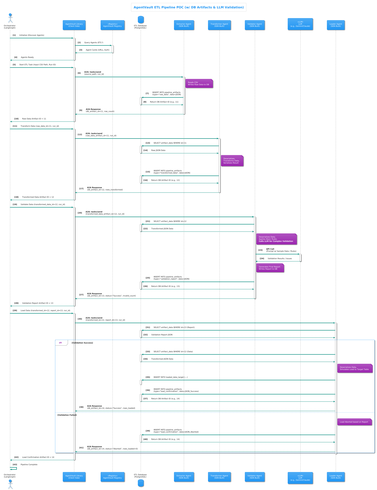

# ETL Pipeline Example

This Proof-of-Concept (POC) demonstrates a simple Extract, Transform, Load (ETL) pipeline orchestrated using AgentVault and LangGraph.

## Overview

The pipeline simulates processing data from a source (CSV file), transforming it, validating it, and loading it into a mock target. It highlights the use of a shared database for passing artifacts between agents, rather than sending large data payloads directly via A2A messages.

## Workflow Diagram

The diagram below shows the sequential flow of the ETL pipeline, where each agent passes the database ID of its output artifact to the next agent.


*(Diagram illustrating the flow: Orchestrator calls Extractor, which saves to DB and returns ID. Orchestrator calls Transformer with ID, Transformer saves to DB and returns new ID, and so on for Validator and Loader.)*

## Workflow Steps

1.  **Orchestrator (`etl_orchestrator`) -> Data Extractor Agent (`local-poc/etl-data-extractor`)**
    *   **Input:** Path to source CSV file (e.g., `/data/input_data.csv`), `run_id`.
    *   **Action:** Reads CSV, stores raw data content (as JSON list of dicts) in the `pipeline_artifacts` database table.
    *   **Output:** Database ID (`artifact_db_id`) of the stored raw data artifact, number of rows extracted.
2.  **Orchestrator -> Data Transformer Agent (`local-poc/etl-data-transformer`)**
    *   **Input:** `artifact_db_id` of the raw data, `run_id`.
    *   **Action:** Fetches raw data artifact from DB, performs transformations (e.g., rename columns, convert types), stores transformed data in DB.
    *   **Output:** `artifact_db_id` of the stored transformed data artifact, number of rows transformed.
3.  **Orchestrator -> Data Validator Agent (`local-poc/etl-data-validator`)**
    *   **Input:** `artifact_db_id` of the transformed data, `run_id`.
    *   **Action:** Fetches transformed data artifact from DB, applies validation rules (e.g., check for required fields, valid values), stores validation report in DB.
    *   **Output:** `artifact_db_id` of the stored validation report artifact, overall validation status (`Success`, `Failed`), number of invalid rows.
4.  **Orchestrator -> Data Loader Agent (`local-poc/etl-data-loader`)**
    *   **Input:** `artifact_db_id` of transformed data, `artifact_db_id` of validation report, `run_id`.
    *   **Action:** Fetches transformed data and validation report from DB. If validation status is "Success", simulates loading data into a mock target table (`loaded_data_target`) within the same DB. Stores a load confirmation artifact in DB.
    *   **Output:** `artifact_db_id` of the stored load confirmation artifact, load status (`Success`, `Aborted`, `Failed`), rows processed, rows loaded.
5.  **Orchestrator:** Logs the final status and artifact IDs.

## Components

*   **`poc_agents/etl_pipeline/`**: Root directory for this POC.
    *   **`db/`**: Contains PostgreSQL initialization script (`init.sql`) to create the `pipeline_artifacts` table.
    *   **`data/`**: Contains sample input CSV file (`input_data.csv`). Mounted into agent containers.
    *   **`data_extractor_agent/`**: Agent to read CSV and store raw data artifact.
    *   **`data_transformer_agent/`**: Agent to fetch, transform, and store transformed data artifact.
    *   **`data_validator_agent/`**: Agent to fetch, validate, and store validation report artifact.
    *   **`data_loader_agent/`**: Agent to fetch data/report, mock load, and store confirmation artifact.
    *   **`etl_pipeline_orchestrator/`**: LangGraph-based orchestrator managing the workflow.
    *   **`docker-compose.yml`**: Runs the PostgreSQL database, all agents, and the orchestrator.

## Setup

1.  **Prerequisites:** Docker, Docker Compose, Python 3.10+, Poetry. Ensure the `agentvault_network` Docker network exists (`docker network create agentvault_network`). The AgentVault Registry should also be running.
2.  **Database:** The `docker-compose.yml` file defines a PostgreSQL service (`etl-db`) specifically for this pipeline's artifact storage. It will be created automatically.
3.  **Environment Variables:**
    *   Each agent directory (`data_extractor_agent`, etc.) has an `.env` file containing the necessary `DATABASE_*` variables to connect to the `etl-db` service within the Docker network.
    *   The orchestrator's `.env` needs `AGENTVAULT_REGISTRY_URL`.
4.  **Input Data:** Place your input CSV file (e.g., `input_data.csv`) inside the `poc_agents/etl_pipeline/data/` directory. This directory is mounted into the extractor agent's container at `/data`.
5.  **Build & Run Docker Compose:**
    *   Navigate to the `poc_agents/etl_pipeline/` directory.
    *   Run: `docker-compose build`
    *   Run: `docker-compose up -d`

## Running the POC

The orchestrator runs automatically on startup, triggered by the Dockerfile's `CMD`. It uses `/data/input_data.csv` as the default input file path.

1.  **Monitor Logs:** Observe the orchestrator's logs:
    ```bash
    docker logs -f etl-pipeline-orchestrator
    ```
    You can also check individual agent logs (e.g., `docker logs -f etl-data-extractor-agent`).
2.  **Check Database:** Connect to the `etl-db` container or use a DB client (connecting to `localhost:5434`) to inspect the `pipeline_artifacts` table and the `loaded_data_target` table (created by the loader).
    *   User: `etl_user`
    *   Password: `etl_password`
    *   Database: `etl_poc_db`
    *   Example Query: `SELECT id, run_id, step_name, artifact_type, created_at FROM pipeline_artifacts ORDER BY created_at DESC;`

## Example Run (GIF)

This animation demonstrates the typical log output from running the ETL pipeline via Docker Compose. It shows the orchestrator calling each agent sequentially and the agents logging their interactions with the database.


*(Animation showing logs from the orchestrator and ETL agents (Extractor, Transformer, Validator, Loader) interacting with the database)*

## Expected Output

*   **Orchestrator Logs:** Show the pipeline steps, agent calls, and the final status (COMPLETED or FAILED). It will list the database IDs for each artifact created.
*   **`pipeline_artifacts` Table:** Contains JSONB records for `raw_data`, `transformed_data`, `validation_report`, and `load_confirmation`.
*   **`loaded_data_target` Table:** Contains rows corresponding to the validated data if the pipeline completed successfully.

## Key Features Demonstrated

*   **Multi-Agent ETL Workflow:** Orchestrating distinct ETL stages using specialized agents.
*   **Database as Artifact Store:** Using a database (PostgreSQL with JSONB) to pass data between agents instead of large A2A messages. Agents interact via artifact IDs.
*   **LangGraph Orchestration:** Defining the ETL flow as a state graph.
*   **AgentVault Client/SDK:** Used by orchestrator and agents for communication and task management.
*   **Configuration:** Using `.env` files for agent-specific database credentials and orchestrator configuration (`etl_config.json`).
*   **Docker Networking & Volumes:** Enabling communication between services and providing input data.
