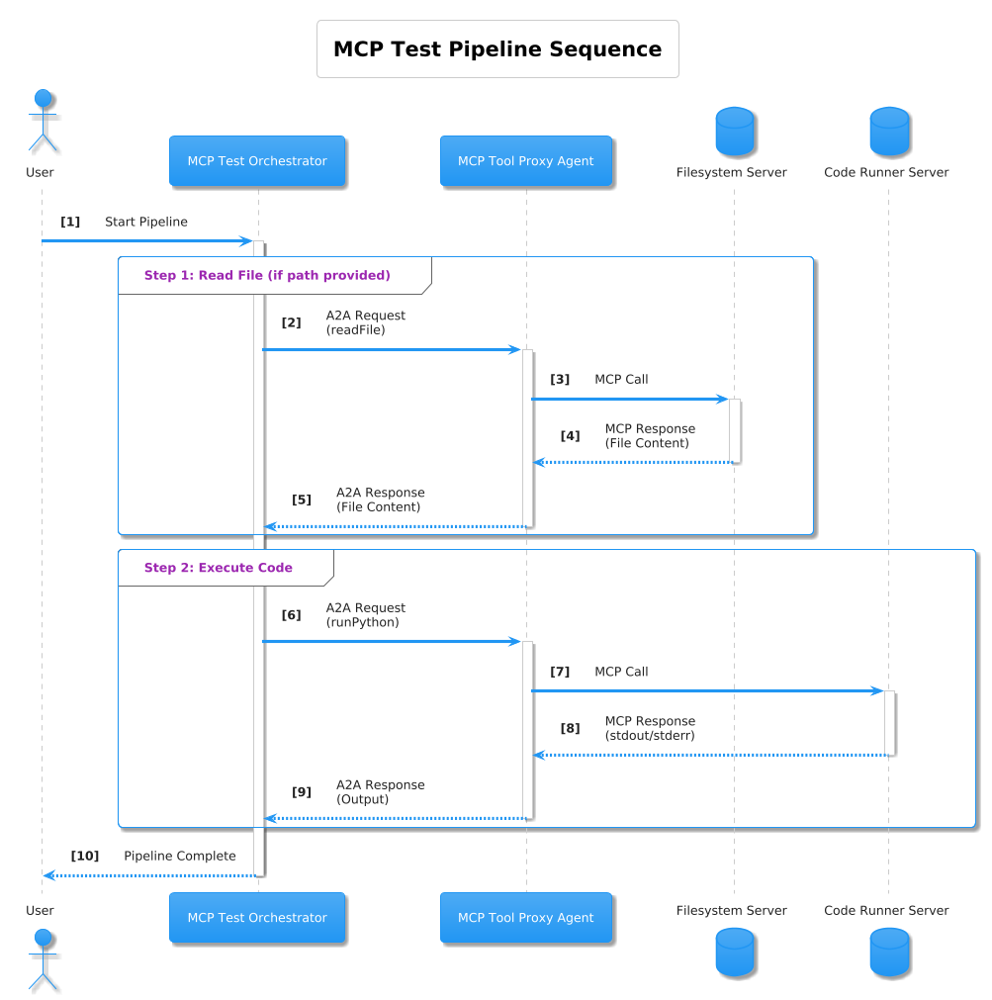
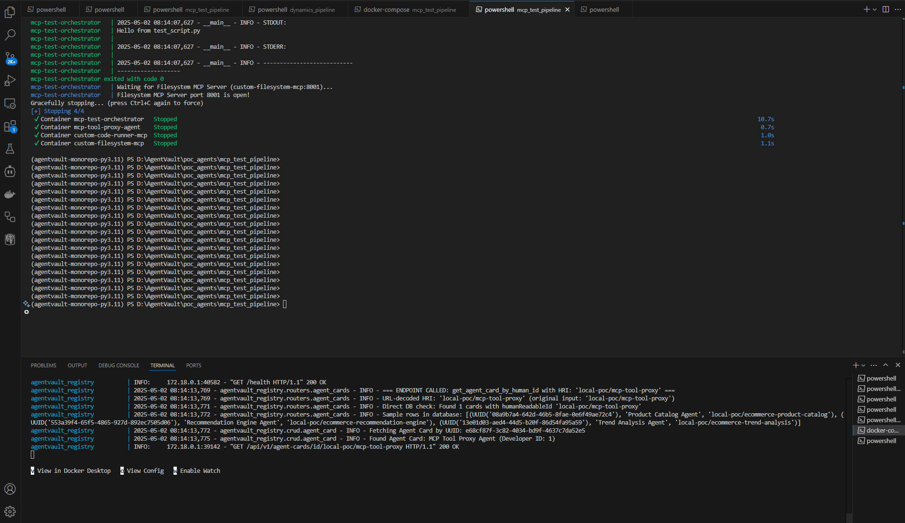

# MCP Test Pipeline Example

This Proof-of-Concept (POC) demonstrates how AgentVault can interact with tool servers compliant with the **Model Context Protocol (MCP)**, enabling agents to execute external tools like filesystem operations or code execution securely.

## Overview

The core idea is to use a specialized **MCP Tool Proxy Agent**. This A2A-compliant agent acts as a bridge:

1.  It receives standard A2A `tasks/send` requests from an orchestrator (like the MCP Test Orchestrator).
2.  The request payload specifies which MCP tool server to target (e.g., 'filesystem', 'code-runner') and the tool method to call (e.g., `filesystem.readFile`, `code.runPython`) along with its arguments.
3.  The Proxy Agent translates the A2A request into a JSON-RPC 2.0 request suitable for the target MCP server.
4.  It sends the JSON-RPC request to the MCP server's `/rpc` endpoint via HTTP POST.
5.  It receives the JSON-RPC response from the MCP server.
6.  It translates the MCP response (including success/failure and results/errors) back into an A2A artifact or message for the orchestrator.

This allows LangGraph orchestrators (or any A2A client) to leverage MCP tools without needing direct MCP communication capabilities themselves.

## Workflow Diagram

This diagram shows the interaction flow where the orchestrator uses the MCP Tool Proxy Agent to communicate with the custom Filesystem and Code Runner MCP servers.


*(Diagram showing the orchestrator calling the MCP Tool Proxy, which in turn calls the Filesystem MCP Server and the Code Runner MCP Server via JSON-RPC/HTTP.)*

## Workflow Steps

1.  **Orchestrator (`mcp_test_orchestrator`)** -> **MCP Tool Proxy Agent** (`local-poc/mcp-tool-proxy`)
    *   **Input:** A2A Task with `DataPart` containing: `target_mcp_server_id="filesystem"`, `tool_name="filesystem.readFile"`, `arguments={"path": "/data/test_script.py"}`.
2.  **MCP Tool Proxy Agent** -> **Filesystem MCP Server** (`custom-filesystem-mcp`)
    *   **Input:** HTTP POST to `/rpc` with JSON-RPC payload (`method="filesystem.readFile"`).
3.  **Filesystem MCP Server** -> **MCP Tool Proxy Agent**
    *   **Output:** HTTP Response with JSON-RPC payload containing file content.
4.  **MCP Tool Proxy Agent** -> **Orchestrator**
    *   **Output:** A2A Task Completion with file content.
5.  **Orchestrator (`mcp_test_orchestrator`)** -> **MCP Tool Proxy Agent** (`local-poc/mcp-tool-proxy`)
    *   **Input:** A2A Task with `DataPart` containing: `target_mcp_server_id="code"`, `tool_name="code.runPython"`, `arguments={"code": "..."}` (code read from file).
6.  **MCP Tool Proxy Agent** -> **Code Runner MCP Server** (`custom-code-runner-mcp`)
    *   **Input:** HTTP POST to `/rpc` with JSON-RPC payload (`method="code.runPython"`).
7.  **Code Runner MCP Server** -> **MCP Tool Proxy Agent**
    *   **Output:** HTTP Response with JSON-RPC payload containing script stdout/stderr.
8.  **MCP Tool Proxy Agent** -> **Orchestrator**
    *   **Output:** A2A Task Completion with script output.

## Components

*   **`poc_agents/mcp_test_pipeline/`**: Root directory for this POC.
    *   **`custom-filesystem-mcp/`**: A Python/FastAPI implementation of an MCP server providing `filesystem.*` tools. Uses a shared Docker volume (`/data`). Exposes `/rpc`.
    *   **`custom-code-runner-mcp/`**: A Python/FastAPI implementation of an MCP server providing `code.runPython`. Exposes `/rpc`.
    *   **`mcp-tool-proxy-agent/`**: The A2A agent built with the `agentvault-server-sdk` that acts as the bridge. It reads target server URLs from its `.env` file (mapped by logical IDs like "filesystem", "code").
    *   **`mcp_test_orchestrator/`**: A LangGraph-based orchestrator that defines the read-then-execute workflow.
    *   **`mcp_shared_data/`**: Contains example files (like `test_script.py`) mounted into the shared Docker volume (`/data`) accessible by the filesystem server.
    *   **`docker-compose.mcp-test.yml`**: Docker Compose file specifically to run this pipeline, including the custom Python MCP servers and the proxy agent.

## Setup

1.  **Prerequisites:** Docker, Docker Compose, Python 3.10+, Poetry. Ensure the `agentvault_network` Docker network exists (`docker network create agentvault_network`). The AgentVault Registry should also be running.
2.  **Environment Variables:**
    *   Review/create `.env` files within `mcp-tool-proxy-agent/` and `mcp_test_orchestrator/`.
    *   The `mcp-tool-proxy-agent/.env` **must** contain the `MCP_SERVER_MAP` variable correctly mapping logical server IDs to their internal Docker service URLs:
        ```env
        # Example MCP_SERVER_MAP in mcp-tool-proxy-agent/.env
        MCP_SERVER_MAP={"filesystem": "http://custom-filesystem-mcp:8001", "code": "http://custom-code-runner-mcp:8002"}
        AGENTVAULT_REGISTRY_URL=http://host.docker.internal:8000 # Or your registry URL
        ```
    *   The orchestrator's `.env` needs `AGENTVAULT_REGISTRY_URL`.
3.  **Build & Run Docker Compose:**
    *   Navigate to the `poc_agents/mcp_test_pipeline/` directory.
    *   Run: `docker-compose -f docker-compose.mcp-test.yml build`
    *   Run: `docker-compose -f docker-compose.mcp-test.yml up -d`

## Running the POC

The orchestrator runs automatically on startup, processing `/data/test_script.py`.

1.  **Monitor Logs:**
    ```bash
    docker logs -f mcp-test-orchestrator
    ```
2.  **Expected Log Flow:**
    *   Orchestrator starts, discovers proxy agent.
    *   `start_mcp_test` node runs.
    *   `read_code_file_via_proxy` node runs, calls proxy, which calls filesystem server.
    *   `execute_python_code_via_proxy` node runs, calls proxy, which calls code runner server.
    *   Pipeline finishes, logs show stdout/stderr from the executed script.

## Example Run (GIF)

This animation displays the log output as the orchestrator interacts with the MCP Tool Proxy Agent, which then communicates with the custom Filesystem and Code Runner MCP servers via JSON-RPC.


*(Animation showing logs from the orchestrator, proxy agent, filesystem server, and code runner server during the test script execution)*

## Key Features Demonstrated

*   **Model Context Protocol (MCP):** Interaction with MCP-compliant tool servers via JSON-RPC over HTTP.
*   **A2A-MCP Bridging:** Using a proxy agent (`mcp-tool-proxy-agent`) to allow A2A orchestrators to leverage MCP tools.
*   **Tool Execution:** Secure execution of external tools (filesystem access, code running) via dedicated servers.
*   **Custom MCP Servers:** Python/FastAPI implementations of MCP servers providing specific functionalities.
*   **Docker Networking & Volumes:** Enabling communication and shared file access between services.
*   **LangGraph Orchestration:** Managing the state and workflow involving proxied tool calls.
