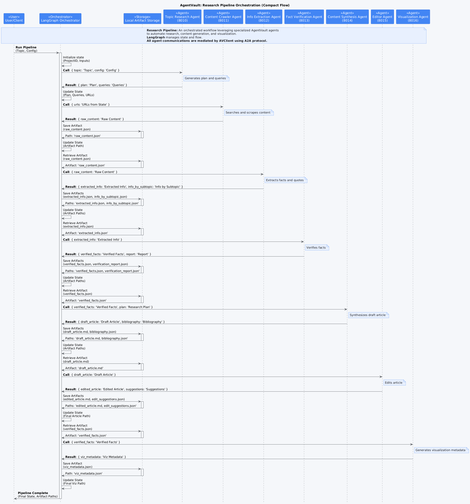

# Research Pipeline Example

This Proof-of-Concept (POC) demonstrates a sophisticated multi-agent pipeline designed to automate the research and generation of a comprehensive report on a given topic.

## Overview

The pipeline orchestrates 7 specialized agents, each handling a specific stage of the research process, from initial topic exploration to final content editing and visualization. It showcases advanced AgentVault concepts like complex workflows, artifact passing, and leveraging specialized agent skills.

## Workflow Diagram

The diagram below depicts the flow of control and data artifacts between the orchestrator and the seven agents in the research pipeline.


*(Diagram showing the orchestrator sequentially calling Topic Research, Content Crawler, Information Extraction, Fact Verification, Content Synthesis, Editor, and Visualization agents, passing artifacts between relevant steps.)*

## Workflow Steps

1.  **Orchestrator (`langgraph_research_orchestrator`) -> Topic Research Agent (`local-poc/topic-research`)**
    *   **Input:** Research `topic`, `depth`, `focus_areas`.
    *   **Output:** Structured `research_plan` (subtopics, questions) and `search_queries`.
2.  **Orchestrator -> Content Crawler Agent (`local-poc/content-crawler`)**
    *   **Input:** `search_queries` from the previous step.
    *   **Action:** Searches the web using configured engines, scrapes content from relevant URLs.
    *   **Output:** `raw_content` artifact (list of dicts containing URL, title, scraped text, query source).
3.  **Orchestrator -> Information Extraction Agent (`local-poc/information-extraction`)**
    *   **Input:** `raw_content` artifact.
    *   **Action:** Analyzes scraped text using an LLM to extract key facts, statistics, and direct quotes relevant to the research subtopics.
    *   **Output:** `extracted_information` artifact (list of all extracted facts/quotes) and `info_by_subtopic` artifact (facts/quotes grouped by subtopic).
4.  **Orchestrator -> Fact Verification Agent (`local-poc/fact-verification`)**
    *   **Input:** `extracted_information` artifact.
    *   **Action:** Uses an LLM to assess the credibility of each fact based on source URL and content, assigns a confidence score, and flags potential contradictions.
    *   **Output:** `verified_facts` artifact (facts annotated with verification status, confidence, notes) and `verification_report` artifact (list of issues found).
5.  **Orchestrator -> Content Synthesis Agent (`local-poc/content-synthesis`)**
    *   **Input:** `verified_facts`, `research_plan`.
    *   **Action:** Uses an LLM to generate a structured draft article (Markdown) based on the verified facts, following the research plan outline. Creates citations.
    *   **Output:** `draft_article` artifact (Markdown text) and `bibliography` artifact (structured references).
6.  **Orchestrator -> Editor Agent (`local-poc/editor`)**
    *   **Input:** `draft_article`.
    *   **Action:** Uses an LLM to review the draft for clarity, style, grammar, and consistency according to configured preferences.
    *   **Output:** `edited_article` artifact (refined Markdown text) and `edit_suggestions` artifact (list of changes made or suggested).
7.  **Orchestrator -> Visualization Agent (`local-poc/visualization`)**
    *   **Input:** `verified_facts`.
    *   **Action:** Identifies data suitable for visualization within the verified facts and generates placeholder visualization metadata (or actual SVGs if configured).
    *   **Output:** `viz_metadata` artifact (list describing generated visualizations and related facts), potentially individual visualization artifacts (e.g., `bar_chart_1.svg`).
8.  **Orchestrator:** Saves final article, visualization metadata, and all intermediate artifacts locally. Logs completion status.

## Components

*   **`poc_agents/research_pipeline/`**: Contains the individual agent Python scripts (e.g., `topic_research_agent.py`), the shared `base_agent.py`, agent card files (`agent_cards/`), Dockerfiles (`dockerfiles/`), environment configuration (`envs/`), and supporting scripts.
*   **`poc_agents/langgraph_scrapepipe/`**: Contains the LangGraph-based orchestrator (`src/langgraph_research_orchestrator/`), its configuration (`pipeline_config.json`), and runner scripts (`run_pipeline.py`).

## Setup

1.  **Prerequisites:** Docker, Docker Compose, Python 3.11+, Poetry. Ensure the `agentvault_network` Docker network exists (`docker network create agentvault_network`). The AgentVault Registry should also be running.
2.  **LLM Server:** An OpenAI-compatible LLM server (like LM Studio or Ollama) must be running and accessible to the Docker containers (often via `http://host.docker.internal:1234/v1`). Ensure the required models (e.g., Llama 3 Instruct, Nomic Embed) are loaded.
3.  **Environment Variables:** Configure the `.env` files within *each* agent's corresponding directory under `poc_agents/research_pipeline/envs/`. These files define the `LLM_API_URL`, `LLM_API_KEY`, `LLM_MODEL_NAME`, `PORT`, and `AGENT_CARD_PATH` for each agent.
4.  **Orchestrator Configuration:** Configure the orchestrator's `.env` file (`poc_agents/langgraph_scrapepipe/.env`) primarily with `AGENTVAULT_REGISTRY_URL`. Pipeline behavior (timeouts, artifact paths, etc.) is controlled by `pipeline_config.json` within the orchestrator's directory. Use `config_generator.py` to create/modify this file.
5.  **Build & Run Docker Compose:**
    *   Navigate to the `poc_agents/research_pipeline/` directory.
    *   Run: `docker-compose build` (or `docker compose build`)
    *   Run: `docker-compose up -d` (or `docker compose up -d`)

## Running the POC

1.  **Navigate:** Change to the `poc_agents/langgraph_scrapepipe/` directory.
2.  **Run Orchestrator:** Use the provided runner script:
    ```bash
    # Example: Standard depth research on AI in Healthcare
    python run_pipeline.py --topic "Impact of AI on Healthcare" --depth standard

    # Example: Comprehensive research with specific focus areas
    python run_pipeline.py --topic "Quantum Computing Applications" --depth comprehensive --focus-areas "Cryptography" "Drug Discovery"

    # Example: Using a custom configuration file
    python run_pipeline.py --topic "Renewable Energy Storage" --config my_custom_config.json
    ```3.  **Monitor Logs:** Check the orchestrator logs and individual agent logs via `docker logs <container_name>`.

## Example Run (GIF)

This animation captures the log output from the research pipeline orchestrator and the various agents involved as they process a research topic.


*(Animation showing logs from the orchestrator and research agents (topic, crawler, extraction, verification, synthesis, editor, visualization) processing a topic)*

## Expected Output

*   **Orchestrator Logs:** Detailed logs showing each step of the pipeline, agent calls, artifact saving, and the final status.
*   **Local Artifacts:** Generated files stored in the directory specified by `orchestration.artifact_base_path` in the orchestrator's configuration file (defaults to `poc_agents/langgraph_scrapepipe/pipeline_artifacts/`). Files are organized by `project_id` and then by node name (e.g., `pipeline_artifacts/<project_id>/content_synthesis/draft_article.md`).

## Key Features Demonstrated

*   **Complex Multi-Agent Workflow:** Orchestrating a 7-step pipeline.
*   **LangGraph Orchestration:** Defining the workflow as a stateful graph.
*   **Agent Specialization:** Each agent performs a distinct task in the research process.
*   **LLM Integration:** Multiple agents leverage LLMs for different tasks (planning, extraction, verification, synthesis, editing).
*   **A2A Communication:** Agents interact via the AgentVault A2A protocol.
*   **Local Artifact Management:** Passing data between steps by saving/loading local files.
*   **Configuration System:** Centralized configuration for pipeline behavior.
*   **Error Handling & Retries:** Built-in retries for agent communication and error handling within the graph.
