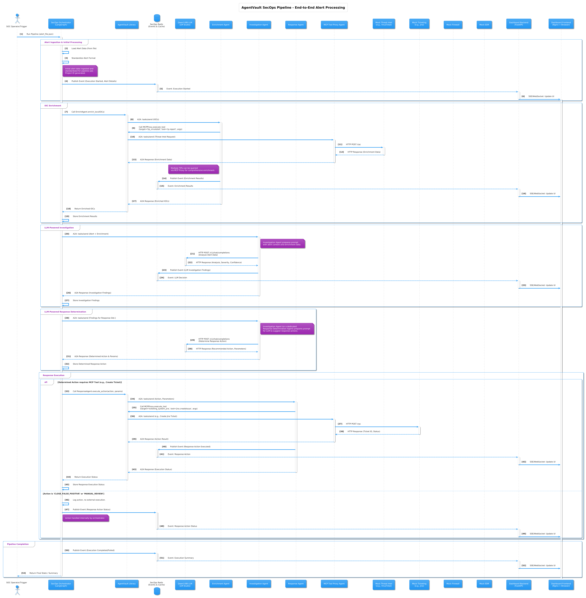

# SecOps Pipeline with Qwen3-8B LLM Integration

This Proof-of-Concept (POC) showcases an advanced Security Operations (SecOps) pipeline that leverages the Qwen3-8B large language model for intelligent security alert analysis, decision making, and automated response.

## Overview

The SecOps pipeline processes security alerts through multiple stages including enrichment, LLM-powered investigation, response determination, and automated action execution. It demonstrates how LLMs can enhance security operations by providing sophisticated reasoning while maintaining full transparency in the decision-making process.

## Workflow Diagram

The diagram below illustrates the flow of the SecOps pipeline, from alert ingestion through LLM analysis to response execution:


*(Diagram showing the orchestrator coordinating the alert flow through the enrichment agent, investigation with Qwen3-8B LLM, response determination, and action execution)*

## Workflow Steps

1. **Alert Ingestion and Standardization**
   * **Input:** Raw security alert data from various sources (SIEM, EDR, etc.)
   * **Process:** Standardizes the alert format for consistent processing
   * **Output:** Standardized alert with extracted metadata

2. **Enrichment Phase**
   * **Orchestrator → Enrichment Agent (`secops-enrichment-agent`)**
   * **Input:** Standardized alert data with Indicators of Compromise (IoCs)
   * **Process:** Gathers context for IPs, domains, file hashes, and other IoCs
   * **Output:** Enrichment results with reputation, geolocation, and other contextual data

3. **LLM Investigation**
   * **Input:** Standardized alert + enrichment results
   * **Process:** Qwen3-8B LLM analyzes the alert data using sophisticated reasoning
   * **Output:** Severity assessment, confidence rating, and detailed reasoning explanation

4. **Response Determination**
   * **Input:** Investigation findings
   * **Process:** Qwen3-8B LLM determines appropriate response action based on findings
   * **Output:** Recommended action (ticket creation, IP blocking, host isolation, etc.)

5. **Response Execution**
   * **Orchestrator → Response Agent (`secops-response-agent`)**
   * **Input:** Determined response action and parameters
   * **Process:** Executes the recommended action via appropriate systems
   * **Output:** Execution status and details

Throughout the process, a real-time dashboard visualizes each step, displaying the enrichment data, LLM reasoning, and response actions.

## Components

* **`secops-orchestrator`**: Coordinates the overall pipeline using LangGraph for state management
* **`secops-enrichment-agent`**: Gathers context for IoCs in security alerts
* **`secops-investigation-agent`**: Interface for LLM-powered alert analysis
* **`secops-response-agent`**: Executes determined response actions
* **`secops-dashboard`**: Real-time visualization of pipeline execution
* **`secops-redis`**: Event bus for real-time dashboard updates

## LLM Integration Details

The SecOps pipeline integrates directly with the Qwen3-8B large language model through an OpenAI-compatible API. This integration provides:

* **Real-time Security Analysis**: Direct API calls to Qwen3-8B for sophisticated reasoning about security alerts
* **Transparent Decision Making**: Complete visibility into the LLM's reasoning process
* **Severity Assessment**: Contextual evaluation of alert severity and confidence level
* **Response Determination**: Intelligent selection of appropriate response actions
* **Fallback Mechanisms**: Robust error handling to ensure reliability even if LLM service is disrupted

The pipeline supports Qwen3-8B's `/no_think` directive for faster analysis when detailed reasoning isn't required, and includes comprehensive error handling with fallback to predefined responses if the LLM service is unavailable.

## Setup

1. **Prerequisites:**
   * Docker and Docker Compose
   * Qwen3-8B model running with OpenAI-compatible API on port 1234
   * Created Docker network: `docker network create agentvault_network`

2. **LLM Configuration:**
   * Ensure Qwen3-8B model is accessible via OpenAI-compatible API
   * Configure environment variables in `docker-compose.secops.yml`:
     ```yaml
     - LLM_API_URL=http://host.docker.internal:1234/v1
     - LLM_MODEL_NAME=qwen3-8b
     - LLM_TIMEOUT_SECONDS=120
     - RUNNING_IN_DOCKER=true
     ```

3. **Start the Pipeline:**
   ```bash
   # Start all components
   docker-compose -f docker-compose.secops.yml up -d
   
   # Process a sample alert
   docker-compose -f docker-compose.secops.yml run --rm secops-orchestrator --alert-file /app/input_alerts/sample_alert1.json
   ```

4. **Access the Dashboard:**
   * Navigate to `http://localhost:8080/` to view the real-time dashboard

## Example Run (GIF)

This animation demonstrates a complete SecOps pipeline execution, showing LLM-powered analysis and the interactive dashboard:


*(Animation showing the processing of a security alert through the pipeline, including LLM reasoning and the interactive dashboard)*

## Supported Alert Types

The pipeline can process various security alert types:

1. **Authentication Alerts**: Failed login attempts, unusual login locations/times
2. **Malware Detection**: Ransomware, trojans, backdoors
3. **Network Scanning**: Port scans, vulnerability probing
4. **Data Exfiltration**: Unusual data transfers, insider threats

## Response Actions

The LLM can determine and execute multiple response actions:

* **CREATE_TICKET**: Creates tickets in external ticketing systems
* **BLOCK_IP**: Blocks malicious IPs at the network perimeter
* **ISOLATE_HOST**: Isolates compromised systems from the network
* **CLOSE_FALSE_POSITIVE**: Dismisses alerts determined to be false positives
* **MANUAL_REVIEW**: Flags alerts requiring human analysis

## Dashboard Features

The interactive dashboard provides:

* **Pipeline Flow Visualization**: Real-time status of each pipeline stage
* **Enrichment Results Display**: IoC lookup results and context
* **LLM Analysis Section**: Severity rating, confidence level, and detailed reasoning
* **Response Action Panel**: Executed action details and status
* **Recent Executions List**: History of pipeline runs with outcomes

## Key Features Demonstrated

* **LLM-Enhanced Security Operations**: Using Qwen3-8B for sophisticated security reasoning
* **LangGraph State Management**: Resilient pipeline with proper state handling
* **Real-time Visualization**: Interactive dashboard showing pipeline execution
* **Transparent AI Decision Making**: Full visibility into LLM reasoning process
* **Automated Security Response**: End-to-end processing from alert to action
* **Error Resilience**: Fallback mechanisms for component failures

## Advanced Usage

The pipeline can be extended with:

* **Custom Alert Types**: Create JSON alert files in `input_alerts/`
* **Enhanced LLM Prompts**: Modify `llm_client.py` to update analysis prompts
* **Additional Response Actions**: Extend the response agent to support new actions
* **Integration with Security Tools**: Connect to actual security infrastructure
