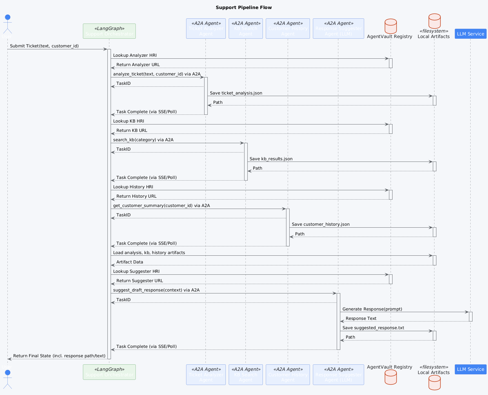

# Support Ticket Pipeline Example

This Proof-of-Concept (POC) demonstrates a multi-agent pipeline designed to automate the initial processing and response suggestion for customer support tickets.

## Overview

The pipeline simulates a common customer support workflow: receiving a ticket, understanding its context (category, sentiment), gathering relevant information (knowledge base articles, customer history), and suggesting a draft response for a human agent.

## Workflow Diagram

The following diagram illustrates the sequence of agent interactions in this pipeline:


*(Diagram illustrating the flow: Orchestrator calls Ticket Analyzer, then KB Search and Customer History concurrently, aggregates results, and finally calls Response Suggester.)*

## Workflow Steps

1.  **Orchestrator (`support_orchestrator`) -> Ticket Analyzer Agent (`local-poc/support-ticket-analyzer`)**
    *   **Input:** `ticket_text`, `customer_identifier`.
    *   **Action:** Analyzes the ticket to determine category, sentiment, and extract key entities (e.g., product names, order IDs). Uses mock logic for this POC.
    *   **Output:** `ticket_analysis` artifact.
2.  **Orchestrator -> Knowledge Base Search Agent (`local-poc/support-kb-search`)**
    *   **Input:** `category` (from ticket analysis), optional `keywords`.
    *   **Action:** Searches a mock knowledge base (loaded from `mock_kb_data.json`) for relevant articles based on the category and keywords.
    *   **Output:** `kb_results` artifact (list of relevant KB articles with summaries and mock relevance scores).
3.  **Orchestrator -> Customer History Agent (`local-poc/support-customer-history`)**
    *   **Input:** `customer_identifier`.
    *   **Action:** Retrieves a mock summary of the customer's status (e.g., VIP, Standard) and recent interaction history (loaded from `mock_customer_data.json`).
    *   **Output:** `customer_history` artifact.
4.  **Orchestrator (Aggregate Node):** Combines results from the previous steps (`ticket_analysis`, `kb_results`, `customer_history`) into the pipeline state.
5.  **Orchestrator -> Response Suggestion Agent (`local-poc/support-response-suggester`)**
    *   **Input:** Aggregated context (ticket analysis, KB results, customer history).
    *   **Action:** Uses an LLM (configured via environment variables) to generate a draft response based on the provided context. Includes empathy, addresses the issue, and may reference KB articles.
    *   **Output:** `suggested_response` artifact (text).
6.  **Orchestrator:** Saves the final suggested response and intermediate artifacts locally. Logs completion status.

## Components

*   **`poc_agents/support_pipeline/`**: Root directory for this POC.
    *   **`agents/`**: Separate directories for each agent (Analyzer, KB Search, History, Suggester), each containing source code, `agent-card.json`, Dockerfile, `.env`, etc.
    *   **`support_pipeline_orchestrator/`**: LangGraph-based orchestrator managing the workflow.
    *   **`docker-compose.yml`**: Runs all agents and the orchestrator.
    *   **`example_tickets.txt`**: Sample customer support tickets for testing.
    *   **`run_example.bat`, `run_all_examples_*.bat`**: Scripts to trigger the pipeline with example tickets.

## Setup

1.  **Prerequisites:** Docker, Docker Compose, Python 3.10+, Poetry. Ensure the `agentvault_network` Docker network exists (`docker network create agentvault_network`). The AgentVault Registry should also be running. An OpenAI-compatible LLM Server (like LM Studio) is required for the Response Suggester agent.
2.  **LLM Server:** Ensure your LLM server is running and accessible (e.g., `http://host.docker.internal:1234/v1`). Load a suitable model (e.g., Llama 3 Instruct 8B).
3.  **Environment Variables:**
    *   Configure the `.env` file in `poc_agents/support_pipeline/response_suggester_agent/` with your `LLM_API_URL`, `LLM_MODEL_NAME`, etc.
    *   Configure the orchestrator's `.env` file (`poc_agents/support_pipeline/support_pipeline_orchestrator/.env`) with `AGENTVAULT_REGISTRY_URL`.
4.  **Build & Run Docker Compose:**
    *   Navigate to the `poc_agents/support_pipeline/` directory.
    *   Run: `docker-compose build`
    *   Run: `docker-compose up -d`

## Running the POC

Use the provided batch scripts (or `docker exec` manually) to run the pipeline with example tickets.

1.  **Wait for Services:** Allow ~30 seconds for all containers to start and initialize.
2.  **Run a Specific Ticket:**
    ```bash
    # Example: Run ticket #2 (Frustrated User)
    .\run_example.bat 2
    ```
    This script extracts the ticket text and customer ID from `example_tickets.txt`, runs the orchestrator via `docker exec`, and streams the orchestrator logs to a file (`ticket_logs/ticket_2_logs.txt`) while also showing the last few lines in the console.
3.  **Run All Tickets:**
    ```bash
    # Runs all 10 example tickets sequentially using docker exec
    .\run_all_examples_via_exec.bat
    ```
    *(Note: `run_all_examples_with_logs.bat` opens a separate log window but might require manual closing)*.
4.  **Monitor Logs:** Observe the orchestrator logs (`docker logs -f support-pipeline-orchestrator`) or the specific ticket log files created by the batch scripts.

## Example Run (GIF)

The following animation shows the console output when running the orchestrator for an example support ticket. It displays the logs from the orchestrator and the agents as they process the ticket through the different stages.


*(Animation showing logs from orchestrator calling analyzer, kb search, history agent, and response suggester, culminating in a final suggested response)*

## Expected Output

*   **Orchestrator Logs:** Show the pipeline steps: analyzing ticket, fetching KB/history, aggregating context, suggesting response. It logs the generated response.
*   **Local Artifacts:** Generated files (analysis, KB results, history, suggested response) stored in the directory specified by `orchestration.artifact_base_path` in the orchestrator's configuration file (defaults to `/app/pipeline_artifacts/support` inside the container, mounted to `poc_agents/support_pipeline/support_pipeline_orchestrator/pipeline_artifacts/support` on the host).

## Key Features Demonstrated

*   **Support Workflow Automation:** Simulating the initial stages of support ticket processing.
*   **Context Aggregation:** Combining information from multiple specialized agents (analyzer, KB, history) before generating a response.
*   **LLM for Response Generation:** Using an LLM via the Suggester agent to draft context-aware responses.
*   **LangGraph Orchestration:** Managing the state and flow of the support pipeline.
*   **AgentVault Client/SDK:** Enabling communication and task management between the orchestrator and agents.
*   **Local Artifact Storage:** Persisting intermediate results for inspection and potential reuse.
